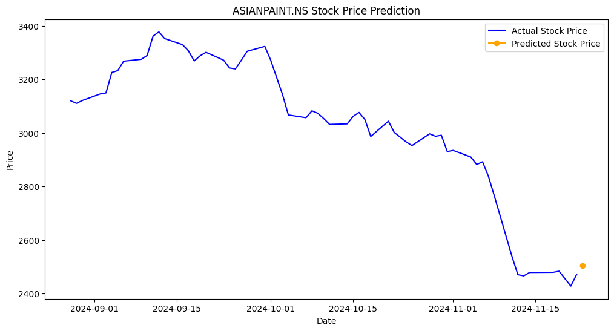
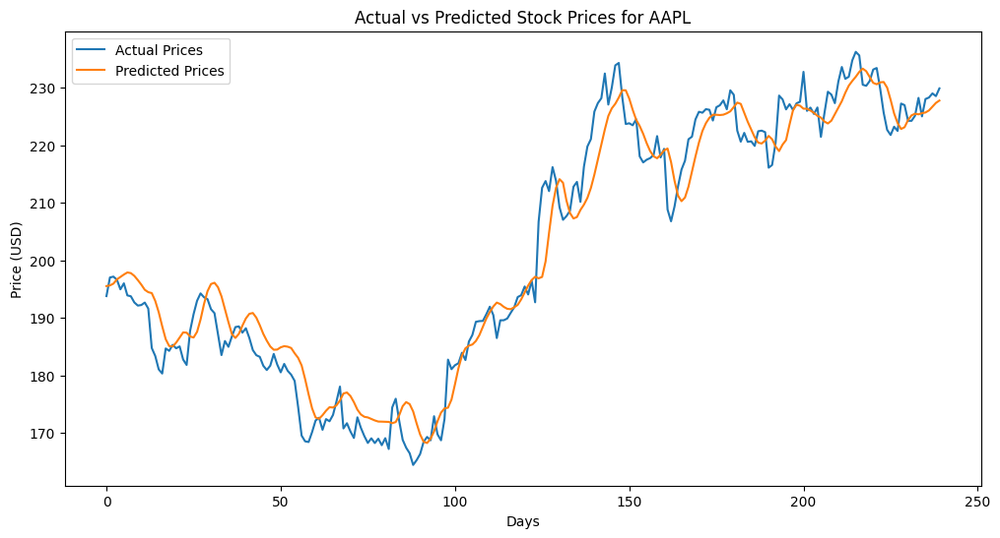
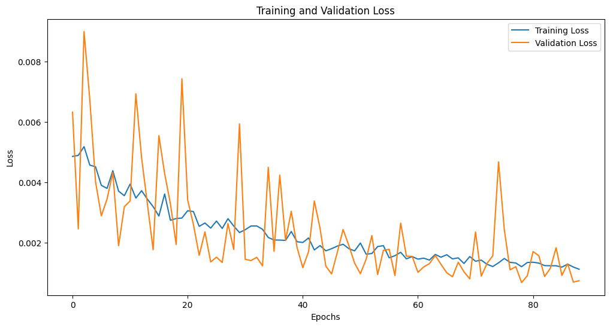

# Stock Market Predictor

ML model to predict the indian stock market price for next day. It predicts whether price of next day goes up or down. It uses LSTM model.
## Features

- Train on recent market data
- Normalized data using MinMaxScaler
- Train test split
- Uses LSTM model 
- Dropout of 0.5 between layers
- Early stop to train data fast
- Visualizing training loss and predictions
- Use rmse parameters to test accuracy
## Tech Stack

**Python**: The core language used to create the model.

**Pandas**: To handle tabular data

**Numpy**: To handle arrays

**yfinance**: Library used to fetch market data.

**Keras**: Used to create LSTM model

**ScikitLearn**: For preprocessing data

**Matplotlib**: For visualizing plots
## Dependencies

To run locally following dependencies must be installed and configured.

- **pandas**
- **numpy**
- **yfinance**
- **Jupyter Notebook**
- **Matplotlib**
- **Python**
- **Tensorflow** 
- **ScikitLearn**
## Run Locally

Clone the project

```bash
git clone https://github.com/menishantsharma/Stock-Market-Predictor
```

Go to the project directory

```bash
cd Stock-Market-Predictor
```

To train model (optional): Run each cell of smp.ipynb notebook one by one.

To predict: Run each cell of predictor.ipynb notebook one by one.

## Screenshots

**Prediction**



**Actual vs Prediction**



**Loss**


## Authors

- **Nishant Sharma** - MTech CSE Student at IIT Bombay
- **Github** - [@Nishant Sharma](https://github.com/menishantsharma)


## License

[MIT](https://choosealicense.com/licenses/mit/)

